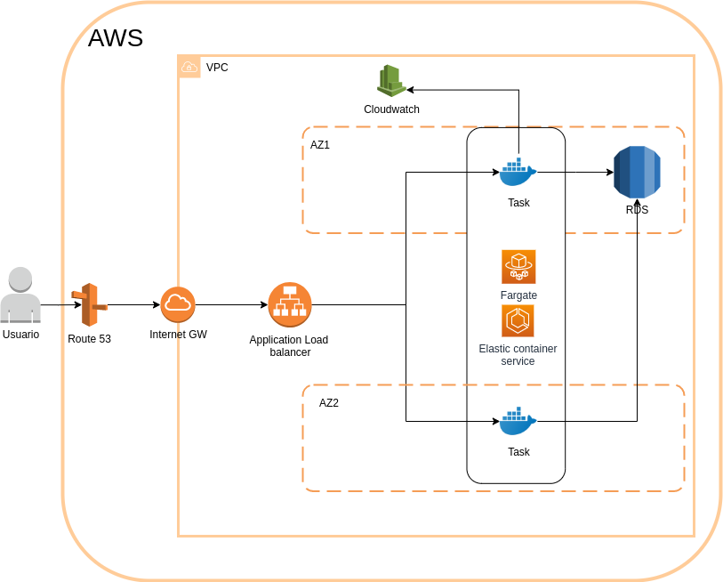

# Moodle con ECS (fargate) y RDS

## Qué resuelve este reopsitorio?

La idea de este proyecto es poder desplegar con un solo click la plataforma de educación "Moodle" en AWS utilizando para esto los dockers creados por Bitnami (https://github.com/bitnami/bitnami-docker-moodle), un cluster de ECS y una base de datos RDS.

### Arquitectura

Como se observa en la siguiente imágen, el stack despliega recursos varios.

Como ingreso para el usuario disponemos de un registro DNS en route53 con nuestro subdominio, el cuál nos es consultado al desplegar el stack.

Este registro nos lleva a un load balancer que a su vez registra los targets que se van creando desde el cluster de ECS mediante Fargate.

Estos dockers en ECS se comunican con RDS, donde se almacenan los datos de la aplicación moodle.

## Cómo lo puedo desplegar?

# Pre requisitos

Antes de desplegarlo, debemos cumplir con una serie de pre-requisitos

- VPC con por lo menos 2 subnets
- Hosted zone en route 53 para poder crear el registro de acceso al subdominio
- Certificado en ACM para ser utilizado por el load balancer.

Si cumplimos con los requisitos podemos desplegar el stack en N. Virginia haciendo click en la imágen que se ve debajo.

| Region    | Nombre                | Crear                                                                                                                                                                                                                                                 |
| --------- | --------------------- | ----------------------------------------------------------------------------------------------------------------------------------------------------------------------------------------------------------------------------------------------------- |
| us-east-1 | US East (N. Virginia) |  |

### To DO!

- EFS: Agregar EFS en los contenedores para poder persistir los datos
- Cloudfront: Agregar cloudfront como CDN para el acceso.
-
